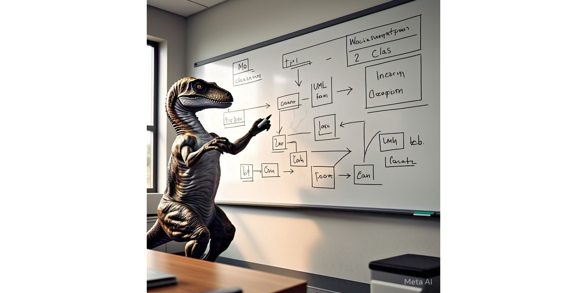

# Técnicas Avanzadas de Diseño de Sotware (TADS) 🦖

<code>Versión. 2025</code>

----

TADS se ofrece como [optativa](https://digesto.unc.edu.ar/handle/123456789/559517) para la Licenciatura en Ciencias de la Computación y los doctorados en Computación, Física, Matemática y Astronomía en la [FAMAF-UNC](https://famaf.unc.edu.ar/).

----

## Clases 🏫

- **Clase 1**:
    - [Sobre el cursado de la materia]
    - [COSAS que estoy armando para el curso]
    - [Revisando OOP]

## Validar el curso en otra facultad/universidad: 🎓

Si van a van a validar el curso en otro programa doctoral que no sea del de FaMAF-UNC, van a necesitar:

- [Programa de la materia](https://drive.google.com/file/d/1JLrDJTSMfL6HJ47lxg3HGjnRtR7g-qPm/view)
- CV de los profesores: *Pedir, así les doy el mas actualizado*

## Recursos 🪨

### Editores 📝

Estos son los [editores o IDE](https://realpython.com/lessons/ides-vs-code-editors/) más populares en Python

- [Vim/NeoVim con *fisa-vim-config*](https://vim.fisadev.com/).
- [Emacs con Python mode](https://www.emacswiki.org/emacs/PythonProgrammingInEmacs).
- [Sublime Text](https://www.sublimetext.com/).
- [Atom](https://atom.io/).
- [VisualStudio Code](https://code.visualstudio.com/) (hay que instalar extensiones para cada lenguaje).
- [PyCharm](https://www.jetbrains.com/pycharm/) (IDE).
- [Geany](https://www.geany.org/).
- [Spyder](https://www.spyder-ide.org/) (IDE).

### Bibliografía 📚

- [Dive into Python 3](http://histo.ucsf.edu/BMS270/diveintopython3-r802.pdf) (PDF)
- [How to Think Like a Computer Scientist: Learning with Python 3](https://www.ict.ru.ac.za/Resources/cspw/thinkcspy3/thinkcspy3.pdf) (PDF)
- [Automate the Boring Stuff with Python](https://automatetheboringstuff.com/)
- [Curso de Python para ciencias e ingenierías](https://github.com/mgaitan/curso-python-cientifico)
- [Pro-Git](https://git-scm.com/book/es/v2)

## Ediciones anteriores ⏰

- [Diseño de Software de Cómputo Científico (La materia anterior)](https://github.com/leliel12/diseno_sci_sfw/tree/)

